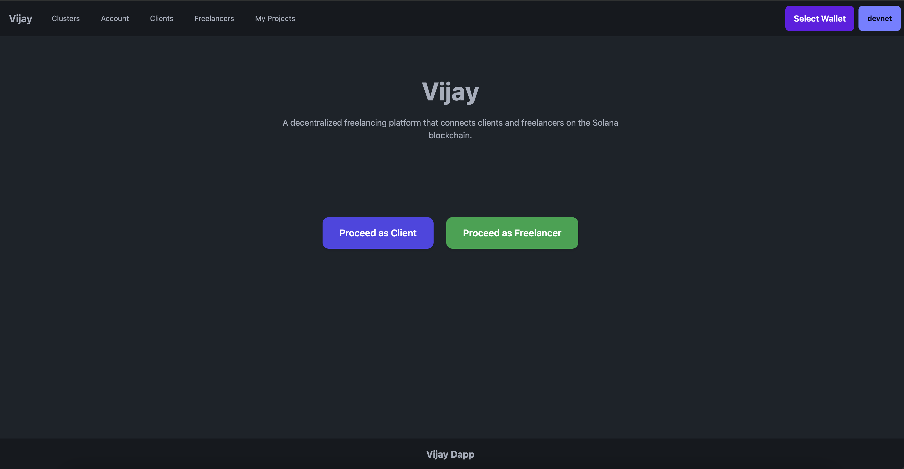
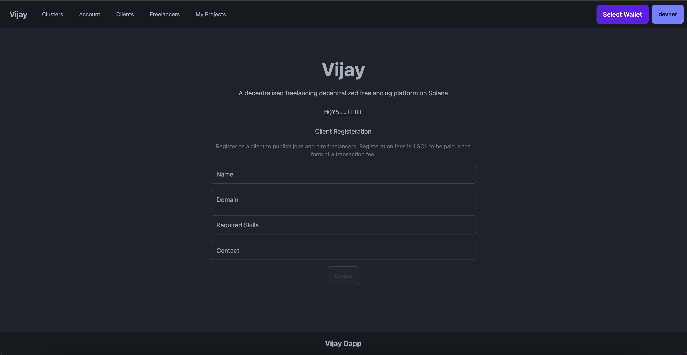
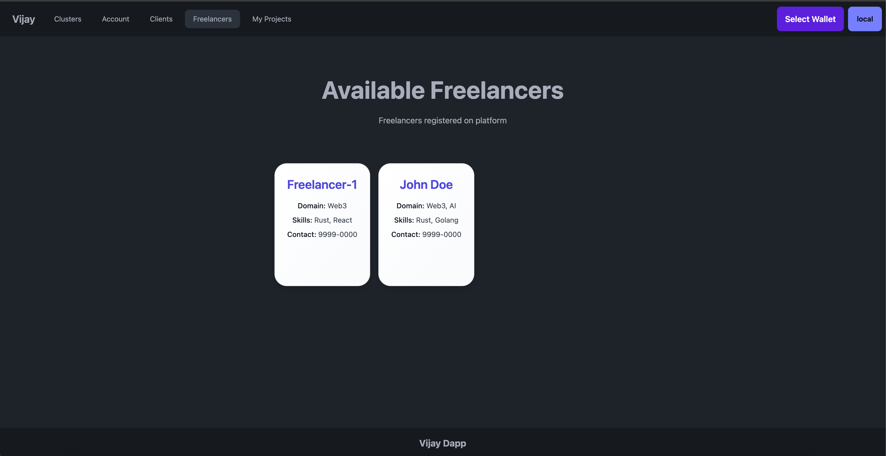
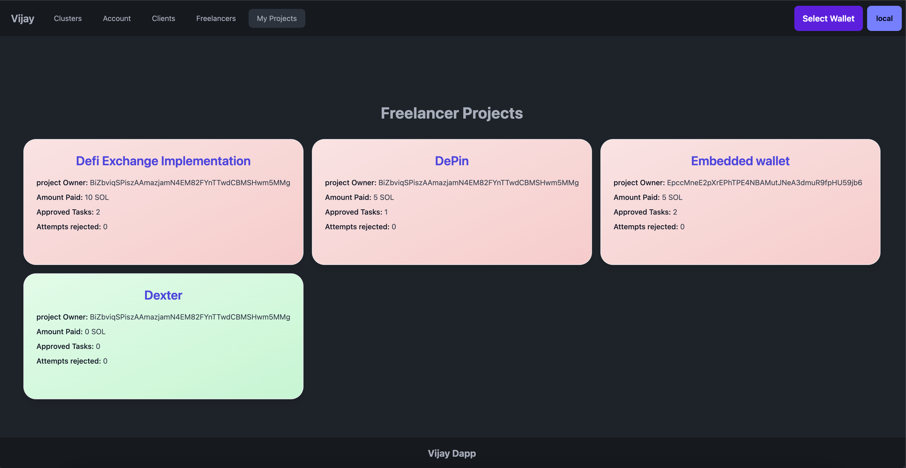
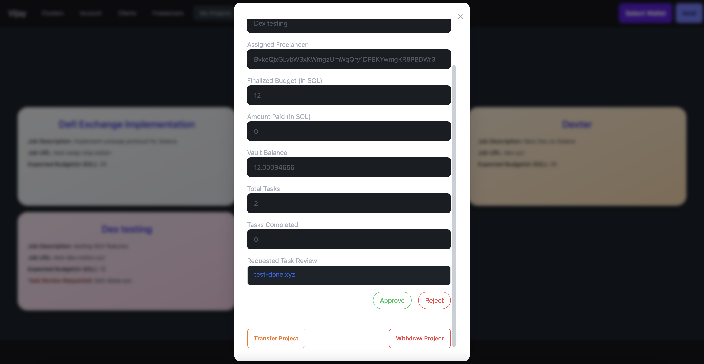
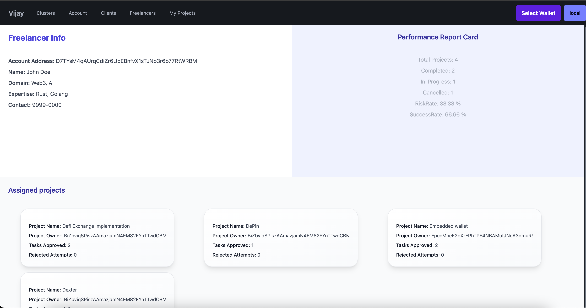
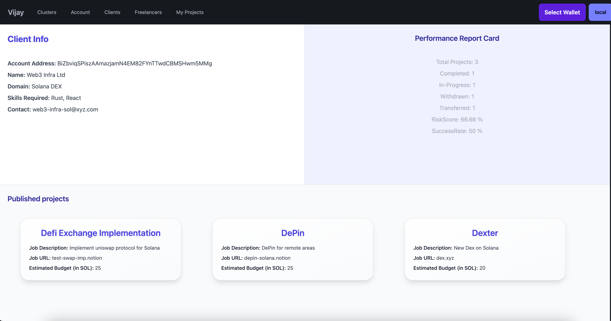

# Vijay: A Trustless Freelancing Platform on Solana

> 🏗️ Built for [Solana Colosseum Hackathon](https://www.colosseum.org/breakout)

## Overview

Vijay is a decentralized freelancing platform built on the Solana blockchain. It introduces a new trustless protocol where clients and freelancers can collaborate on projects securely, without intermediaries. The platform leverages smart contracts to manage registration, project assignment, escrowed payments, and task validation.
It enables Clients and Freelancers to collaborate trustlessly using a milestone-based escrow system. Funds are securely held in program-controlled accounts and released on task approval, ensuring a transparent and secure freelancing experience.

## Table of Contents

* [Overview](#overview)
* [Features](#features)
* [Architecture](#architecture)
* [Directory Structure](#directory-structure)
* [Smart Contract Overview](#smart-contract-overview)
* [Escrow and Vault Logic](#escrow-and-vault-logic)
* [Getting Started](#getting-started)
* [Usage](#usage)
* [Workflow](#workflow)
* [Security & Trust](#security--trust)
* [Roadmap](#roadmap)
* [Screenshots](#demo-screenshots)
* [Contributing](#contributing)
* [License](#license)

---

## Overview

Vijay enables:

* Clients to register and publish projects.
* Freelancers to register and receive projects.
* Task review and milestone-based payouts via escrow.
* Automated vault handling and reputation scoring.


## Features

* **Role-based Registration**

  * Clients register by paying 1 SOL.
  * Freelancers register for free.

* **Project Management**

  * Clients publish projects with name, description, budget, and external links.
  * View and assign registered freelancers based on skills and contact.

* **Escrow and Payment Mechanism**

  * Escrow and vault accounts are created on project assignment.
  * Payments are released per task upon approval by the client.
  * Vaults close automatically when all tasks are completed.

* **Task Flow**

  * Freelancers request reviews by submitting URLs.
  * Clients review, reject, or approve tasks.

* **Advanced Project Controls**

  * Transfer projects to other freelancers mid-way.
  * Close projects prematurely with refunds.

* **Performance Metrics**

  * All actions logged.
  * Users have public report cards showing:

    * Success rate
    * Risk score

---

## Architecture

* **Frontend:** Next.js
* **Smart Contracts:** Solana + Anchor
* **Storage:** Program-derived accounts (PDAs)
* **State:** Managed on-chain via Anchor accounts

---

## Directory Structure

```bash
├── src/                         # Next.js frontend code
├── .next/                       # Next.js build
├── anchor/programs              # Anchor smart contracts
├── anchor/migration_script/     # Custom deploy scripts
├── anchor/.anchor/              # Anchor build outputs
├── Anchor.toml                  # Anchor config
├── tsconfig.json                # TypeScript config
├── README.md                    # Project documentation
```

---

## Smart Contract Overview

### Instructions

* `initializeState`: Sets the program owner so that owner can withdraw amount earned by program via client registeration.
* `initializeClient`: Creates client profile, deducts 1 SOL as regiteration fee.
* `initializeFreelancer`: Creates Freelancer profile. Free registration with skill metadata.
* `initializeProject`: Publishes a project with details.
* `projectEscrowSetup`: Assigns freelancer to a project.
* `requestTaskReview`: Freelancer submits task URL.
* `reviewTaskProcess`: Client either approves, releases per-task payment or rejects task (no payment).
* `transferProject`: Change assigned freelancer.
* `withdrawProject`: Closes project and refunds unspent budget.

### Accounts

* `State`
* `Client`
* `ClientReportCard`
* `Freelancer`
* `FreelancerReportCard`
* `Project`
* `Escrow`
* `Vault`
* `FreelancerProject`

---

## Escrow and Vault Logic

1. **Project Assignment**

   * Vault and escrow PDAs created
   * Full budget held in vault

2. **Task Approval**

   * Budget / total tasks = payout per task
   * Vault → Freelancer upon approval

3. **Project Completion**

   * Vault closed, escrow closed

4. **Early Termination**

   * Refund remaining SOL to Client

---

## Getting Started

### Prerequisites

* [Installation Setup](https://www.anchor-lang.com/docs/installation)

### Installation

1. Clone the repository:

   ```bash
   git clone git@github.com:Harry-027/vijay.git
   cd vijay
   ```

2. Install frontend dependencies:

   ```bash
   pnpm install
   pnpm build
   ```

3. Build and deploy smart contracts locally:

   ```bash
   solana config set --url localhost
   solana-test-validator
   solana airdrop 2
   cd anchor
   anchor build
   anchor deploy
   ```

4. Run the frontend:

   ```bash
   pnpm dev
   ```

5. Set the program owner (make sure you are in the anchor directory before running the below command):

   ```bash
   ANCHOR_PROVIDER_URL=http://127.0.0.1:8899 \
   ANCHOR_WALLET=~/.config/solana/id.json \
   ts-node migration_script/migrate.ts
   ```

---

## Usage

### Client Flow

1. Register as Client (costs 1 SOL)
2. Publish a project
3. Assign project to a freelancer
4. Review task submissions
5. Approve or reject tasks
6. Optionally transfer or withdraw project

### Freelancer Flow

1. Register as Freelancer
2. View available projects
3. Receive assignment
4. Submit tasks via URL
5. Receive payouts on approval

---

### Workflow

1. **Registration**

   * Client pays 1 SOL => ClientAccount created.
   * Freelancer signs up => FreelancerAccount created.

2. **Project Publishing**

   * Client provides project metadata + estimated budget.

3. **Assignment**

   * Client selects a freelancer.
   * Vault and escrow account initialized with project budget.

4. **Task Management**

   * Freelancer submits URL per task.
   * Client verifies and approves.
   * Upon approval: budget/task transferred to freelancer.

5. **Completion**

   * Final task triggers escrow/vault closure.
   * Freelancer receives remaining amount.

6. **Transfer/Abort**

   * Mid-project transfer creates a new assignment.
   * Abort returns remaining funds to client and closes vault.

---

## Security & Trust

* Funds are never held by freelancers until tasks are approved.
* Full audit trail of user actions.
* No intermediary or platform-controlled funds.

---

## Roadmap

* Multi-signature approvals for enterprise clients.
* Dispute resolution via DAO governance.
* Reputation weighting in future smart contracts.

---

## Demo Screenshots

### Dashboard

### Client registeration

### Freelancer registeration

### Available freelancers

### Freelancer project dashboard

### Client action

### Freelancer report card

### Client report card


---

## Contributing

Pull requests are welcome. For major changes, please open an issue first to discuss what you would like to change.
Before submitting a PR be sure to run `anchor test` and `pnpm lint`.

For support or feature requests:
* [GitHub Issues](https://github.com/Harry-027/vijay/issues)

---

## License

MIT © 2025 Harish Bhawnani

## Hackathon Submission

This project was built as part of the **Solana Colosseum Hackathon** to promote milestone-based trustless freelancing using smart contracts on Solana.


